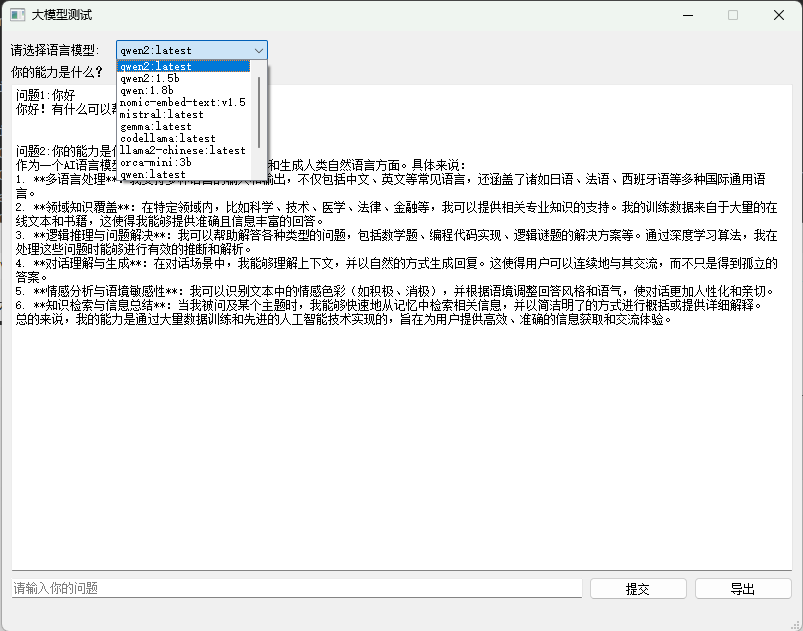
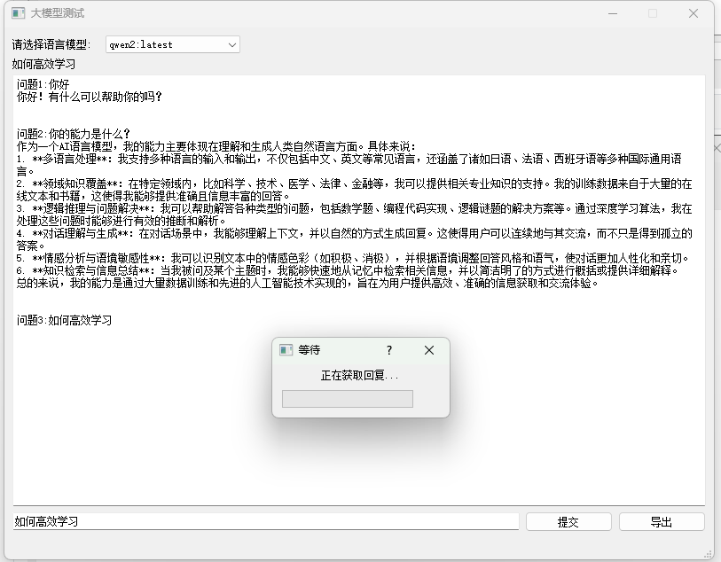
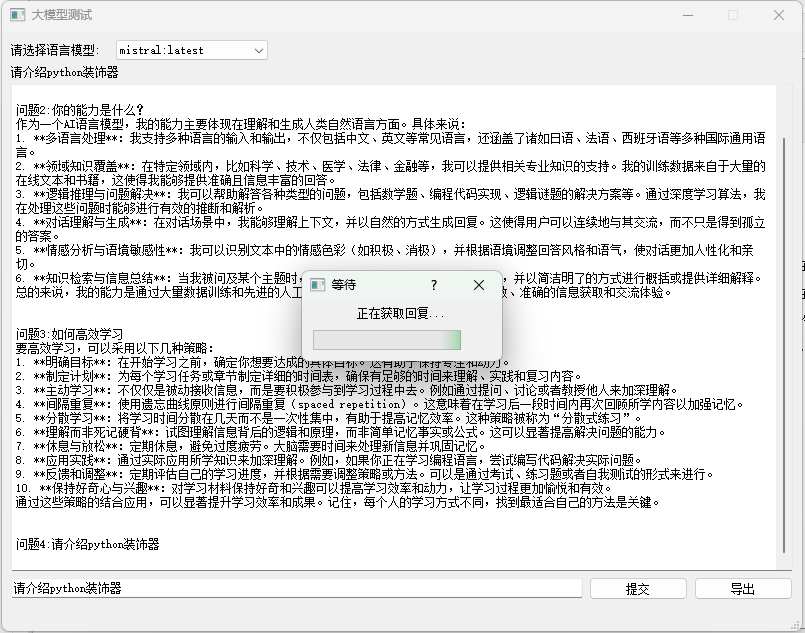
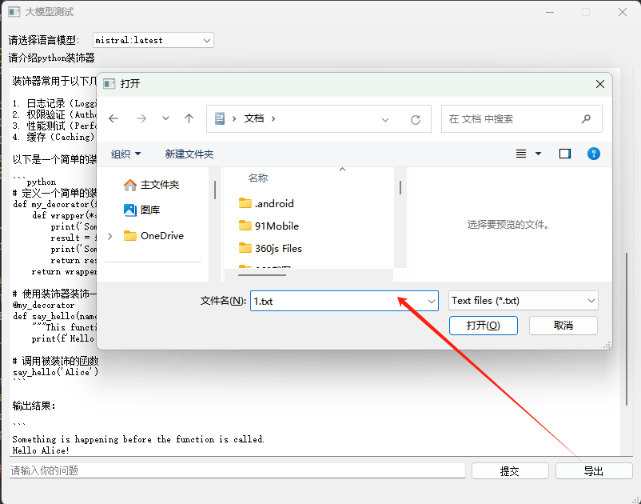
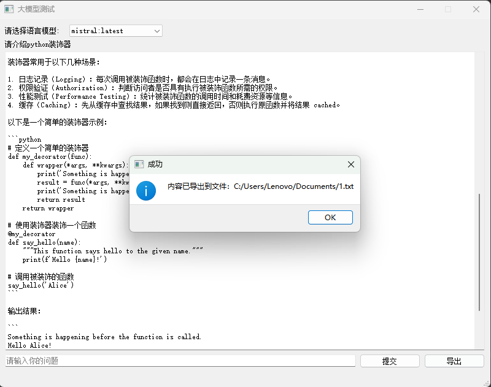

# LLM-QT

## 版本说明

```
# v4版本基础上
# 添加导出文本功能
# 调整textedit组件宽度
```

```
main.py主文件
ui_llm.py QT UI文件

运行主程序自动检测并开启本地ollama模型管理平台，并获取当前可使用的LLM语言模型。
注：ollama需提前安装好。
```


## 功能说明

脚本构建了一个带有图形界面的简单应用，能够：

- 向API发送用户输入的问题并获取回答。
- 异常处理保证程序稳定运行。
- 支持导出聊天记录到文本文件。
- 确保后台服务正常运行以处理请求。
- 使用多线程技术保证UI响应不受网络请求影响。

### 功能演示

| 自动检测并开启本地ollama模型管理平台，加载可用语言模型。     |
| ------------------------------------------------------------ |
|  |
| 选择qwen2模型，开启对话。                                    |
|  |
| 切换LLM为mistral，并开启对话。                               |
|  |
| 导出所有对话内容至txt文档                                    |
|  |
| 导出成功                                                     |
|  |


